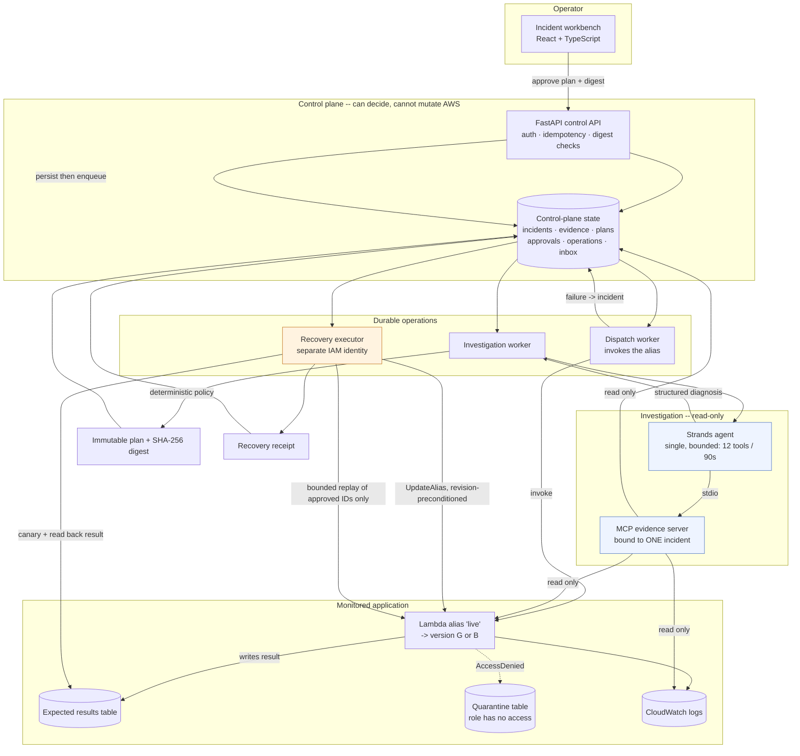
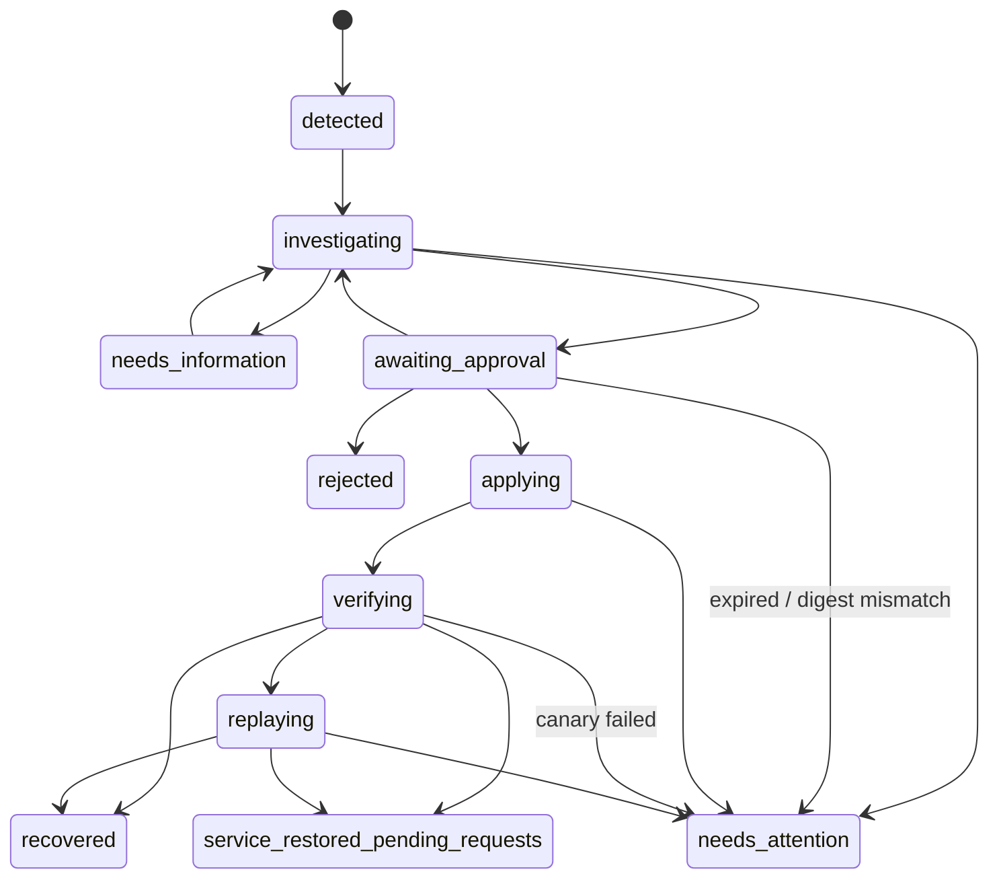

# Architecture

## System diagram

The two shaded boundaries are the design:

- **Blue (read-only):** the agent and its tool server. No mutating tool
  exists, the MCP process cannot import the executor, and in live mode it
  holds a read-only role. Its worst-case output is a wrong recommendation.
- **Amber (mutating):** the executor. The only code that calls
  `UpdateAlias`, in its own process with its own identity, re-validating
  everything immediately before it acts.

## The path of one incident

| # | Step | Who | Key property |
|---|---|---|---|
| 1 | Request persisted, then queued | API | Durable *before* processing, so failure ≠ loss |
| 2 | Alias invoked; `FunctionError` captured | Dispatch worker | The real AWS failure is the evidence |
| 3 | Incident opened or attached | `services/intake.py` | Two dedup layers: source event ID, and active incident by deployment fingerprint |
| 4 | Evidence gathered, diagnosis returned | Agent via MCP | Bounded: 12 tool calls, 90s, 15s/tool, 100 log events |
| 5 | Plan constructed | `plan_policy.py` | Deterministic; 9 prerequisites; refuses with a named reason code |
| 6 | Operator approves | API | Binds actor to digest; stale digest or incident version is refused |
| 7 | Alias rolled back | Executor | `RevisionId` precondition; `STALE_PLAN` rather than overwrite |
| 8 | Recovery verified | Executor | Canary invocation + durable result + payload hash + `ExecutedVersion` |
| 9 | Approved requests replayed | Executor | Only the plan's IDs; conditional insert prevents duplicates |
| 10 | Receipt written | Executor | `recovered` / `partial` / `needs_attention`, with unresolved IDs named |

## Incident lifecycle

`packages/domain/state_machine.py` is the single authority for these edges;
every transition goes through `services/transitions.apply_transition`, which
treats re-entering the current state as a no-op (duplicate queue delivery)
and forces `needs_attention` on a genuinely illegal edge rather than
silently proceeding.

Note the two states that exist specifically to prevent overclaiming:
`service_restored_pending_requests` (health checks passed, customer requests
did not all recover) and `needs_attention` (a human must look).

## Fixture vs live

One `AwsGateway` protocol, chosen once at startup:

| | Fixture | Live |
|---|---|---|
| Lambda alias, results tables, logs | Simulated in SQLite | Real AWS via boto3 |
| Processor logic | `demo/workload/processor.py` | The same file, deployed |
| Verification checks | Identical | Identical |
| Agent | Deterministic stub | Strands + Bedrock |
| Reported as | `mode: "fixture"` everywhere | `mode: "aws_live"` |

See [`decisions/0006-fixture-live-adapters.md`](decisions/0006-fixture-live-adapters.md).

## Hosted deployment (designed, not built)

The local loop becomes: API Gateway + Lambda-adapted FastAPI, Cognito for
operator auth, **separate SQS queues** for investigation and execution so
the two workers keep distinct IAM roles, DynamoDB for control-plane state,
S3 + CloudFront for the frontend, and the investigator on AgentCore Runtime.
Status in [`BUILD_STATUS.md`](BUILD_STATUS.md).
